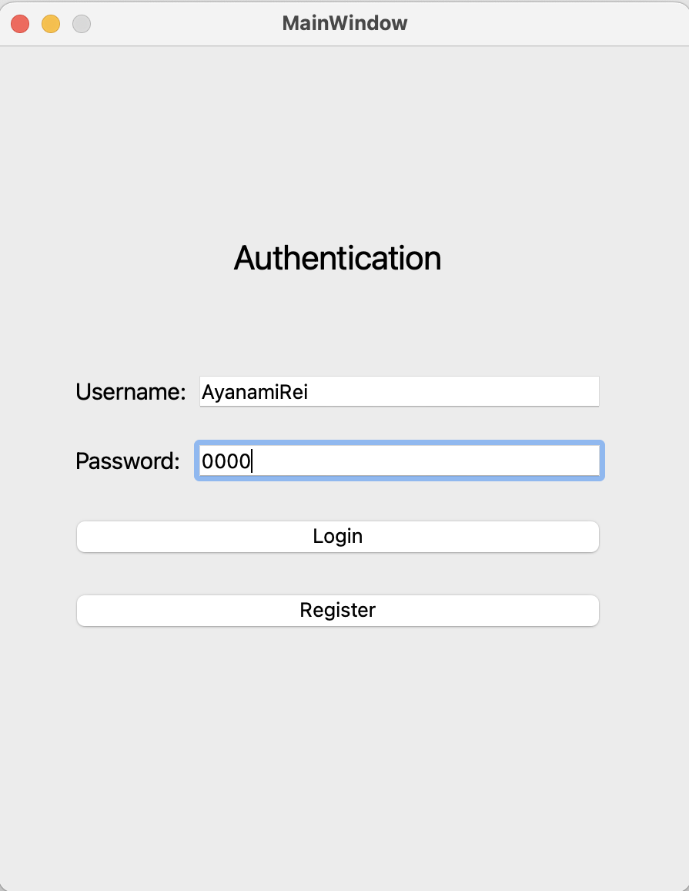
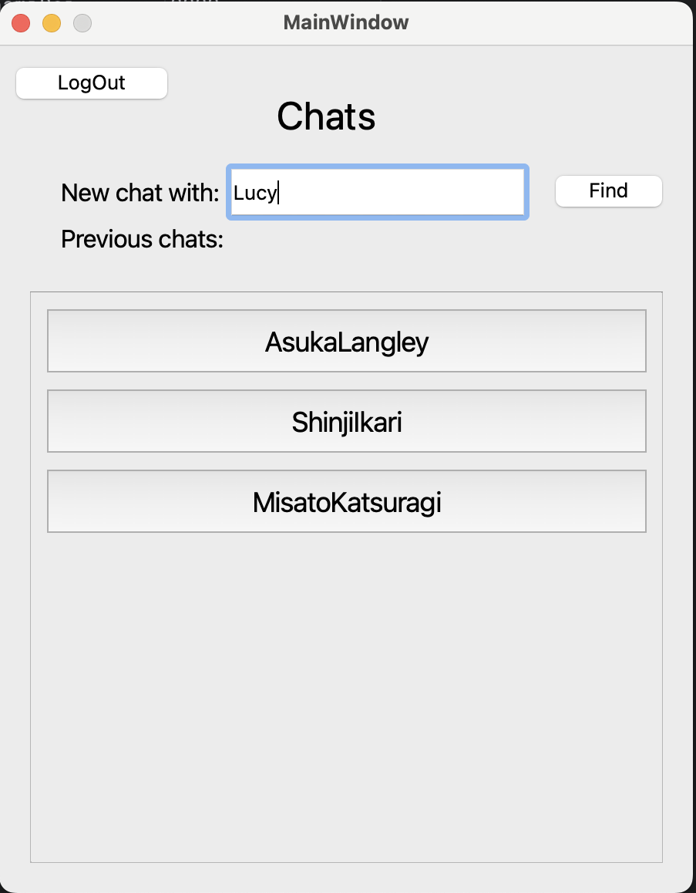
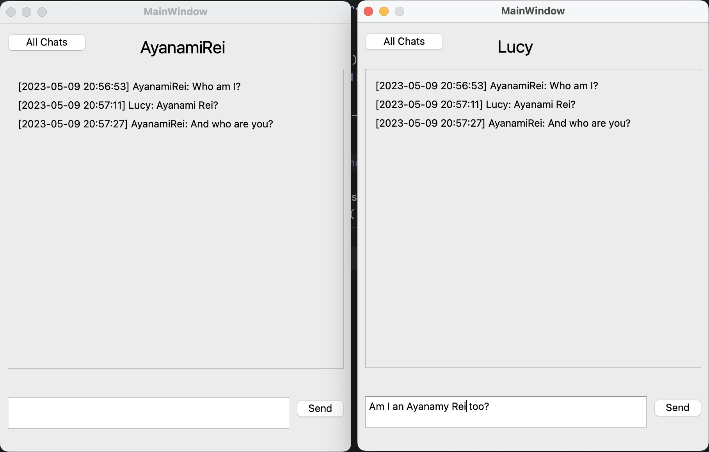

# Vkgram ✉️
_Профильное задание для стажировки Vk_

## Описание 📖

Мессенджер для общения в локальной сети.

### Авторизация:
Авторизация происходит по уникальному username и паролю. Если при попытке залогиниться введенные данные некорректны или при регистрации
введенное имя пользователя уже используется, то выводится сообщение об ошибке.

### Чаты:
В окне чатов представлены контакты, с которыми вы уже переписывались. Также есть возможность написать новому контакту,
найдя его по username.

### Сообщения:
Сообщения отображаются в установленном формате с информацией о времени отправления.

## Скриншоты 📸

#### Экраны авторизации и списка чатов:



#### Экран переписки:


## Реализованный функционал ⚙️

✅ Авторизация/регистрация пользователей

✅ Отправка/прием сообщений

✅ Хранение истории сообщений

✅ Синхронизация сообщений и контактов, в том числе на нескольких устройствах

## Документация 📖

- [Общая](docs/general.md)
- [Сеть](docs/network.md)
- [БД](docs/database.md)
- [Concurrency](docs/concurrency.md)

## Запуск 🚀

### 1. Сборка проекта с помощью CMake + FetchContent:
```
cmake -S . -B build
```

### 2. Компиляция клиента/сервера
```
cmake --build build --target client
cmake --build build --target server
```

### 3. Запуск БД
см. [документацию](docs/database.md) по бд

### 4. Запуск сервера/клиента:
```
build/src/server
build/src/client
```

### 5. Для остановки сервера необходимо послать SIGINT

## ToDO, Bugs, Coming Soon, Future Features, etc... 🪄

☑️ Обработка входных данных от пользователя. Так, например, необходимо проверять пароль на соблюдение каких-либо условий, 
отслеживать крайние случаи по типу пустых запросов и т.д.

☑️ Обработка ошибок сети, БД. Пока что они приводят к падению программы.

☑️ Обрабатывать запросы к БД. Сейчас текст сообщения, пароли, username вставляется в шаблон запроса, что может привести
к синтаксической ошибке (если строка содержит одинарную кавычку) или даже к удалению всей БД (`'; DROP TABLE ...`) 

☑️ Поддержка Linux (подробнее см. [документацию](docs/network.md) по сети).

☑️ Реализация передачи данных пакетами. Сейчас данные передаются максимум по 4KB. Если запрос/ответ весит больше, то данные не дойдут.

☑️ Улучшение механизма синхронизации.

☑️ Улучшение интерфейса клиентского приложения.

☑️ Логирование запросов на стороне сервера.

## Зависимости ⛓️

- [Qt](https://github.com/qt) - графический интерфейс 
- [libpqxx](https://github.com/jtv/libpqxx) - API к PostgreSQL
- [fmt](https://github.com/fmtlib/fmt) - форматированный ввод/вывод
- [concurrency](docs/concurrency.md) - фреймворк для работы с многопоточным кодом