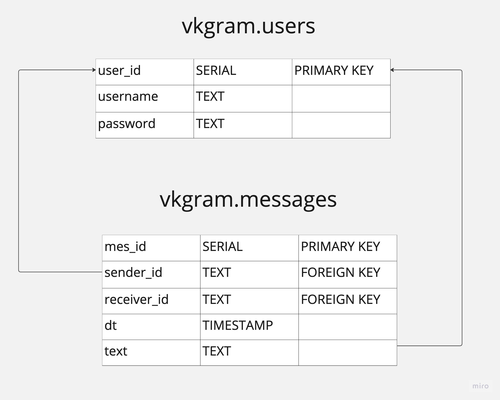
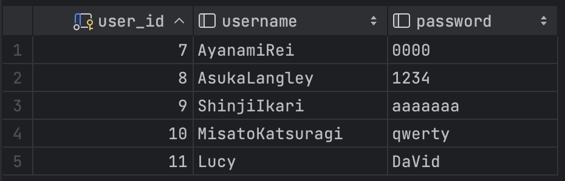
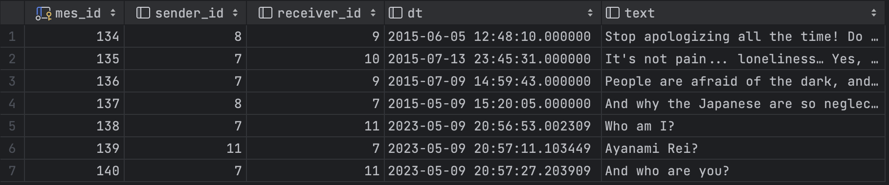
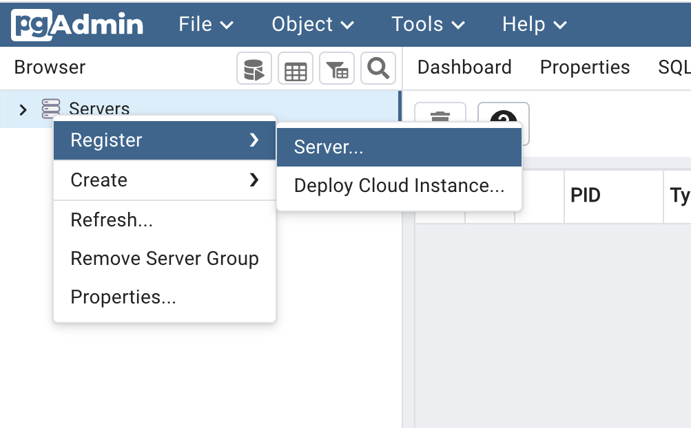
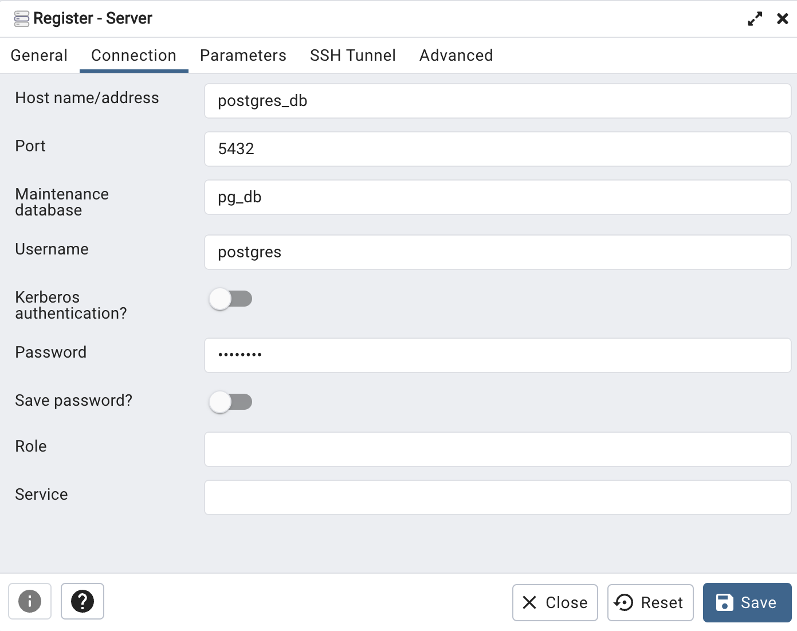

# База данных 💾

БД хранит информацию о пользователях и сообщения. Используется диалект PostgreSQL и библиотека [libpqxx](https://github.com/jtv/libpqxx).

Для работы БД используется docker-compose и pgAdmin.

## Навигация 🗺️

- [Docker файл](../src/database/docker-compose.yml)
- [DDL запросы](../src/database/vkgram_db_ddl.sql)
- [Конфигурация БД для подключения с libpqxx](../src/database/database_config.h)
- [Модуль сервера, отвечающий за связь с БД](../src/server/server_database_module.h)

## Логическая модель



## Описание

В базе данных хранится всего два отношения. В vkgram.users хранится информация
о пользователях - уникальный идентификатор, username и пароль.
В vkgram.messages хранятся сообщения в виде идентификаторов отправителя и получателя, 
времени отправления и текста сообщения.

## Скриншоты 📸




## Инструкция по запуску БД 📖

### Пререквизиты:

- docker-compose


### 1. Запуск докер-контейнера:

Из [директории](../src/database) выполняем

```docker-compose up -d```

Для остановки:

```docker-compose down```

### 2. Подключение к БД из pgAdmin:

В контейнере _pgadmin_ используется 2 переменные среды для входа: адрес электронной почты и пароль:

- email: admin@admin.com
- password: root

Необходимо открыть pgAdmin, перейдя на localhost:8080 в веб-браузере. Используйте для входа тот же адрес электронной почты и пароль, которые вы использовали для запуска контейнера.

Далее выбираем `Servers` > `Register` > `Server...`:



Указываем произвольное имя сервера и заполняем раздел `Connection` следующими данными:

- Host name/address (имя контейнера): `postgres_db`
- Port: `5432` 
- Maintenance database: `pg_db` 
- User: `postgres` 
- Password: `postgres`




### 3. Запустить [DDL скрипты](../src/database/vkgram_db_ddl.sql) для создания отношений

### 4. Остановить контейнер `pgadmin`, он нам больше не понадобится.

### 5. БД готова к работе ✨