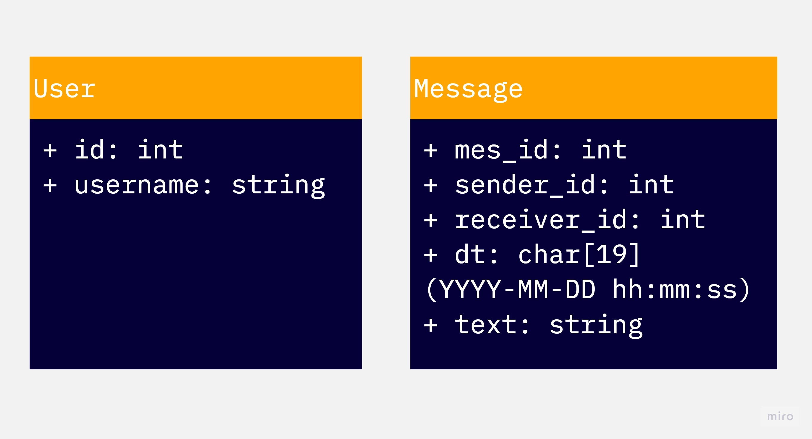
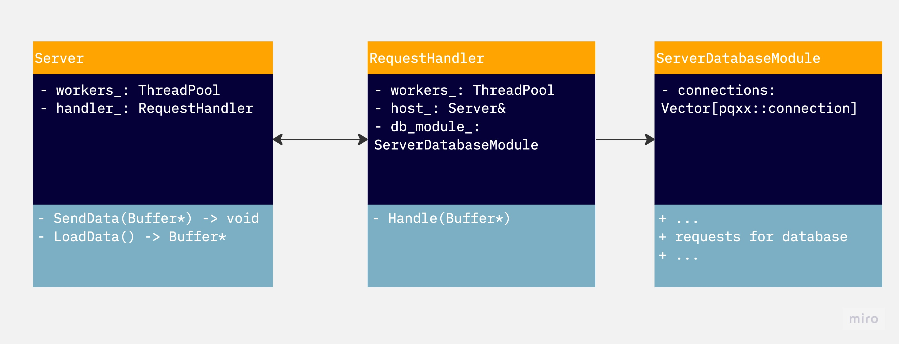
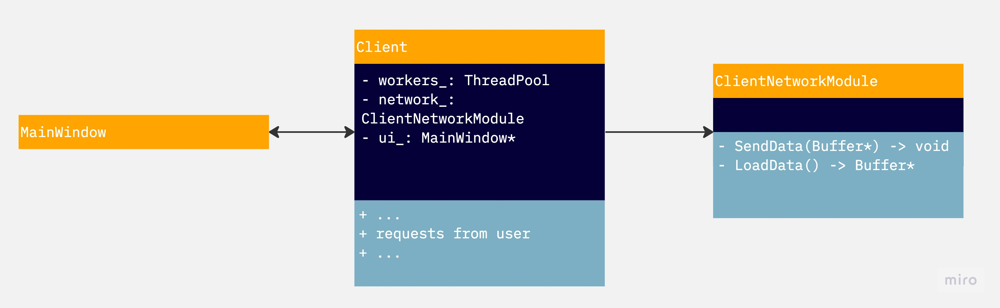

# Vkgram

## Навигация 🗺️

- [Логическая составляющая мессенджера](../src/messanger)
- [Сервер](../src/server)
- [Клиент](../src/client)
- [Интерфейс клиента](../src/interface)
- [Буферы (запросы/ответы) + сериализация](../src/buffers)
- [БД](../src/database)

## Общая структура

## Мессенджер

В логической составляющей мессенджера выделены две сущности: пользователь и сообщение

## Запросы/ответы

У клиента есть 6 видов запроса к серверу:

### 1. Запросы авторизации - `Login`, `Register`
Клиент передает введенные username и пароль, ожидая ответ об успешности авторизации и id пользователя.

### 2. Получение списка контактов - `GetConatcts`
Запрос списка контактов - пользователей, с которыми мы уже общались. Ответ возвращается в виде list[User].

### 3. Получение истории сообщение с пользователем - `GetHistory`
Запрос для получения всей истории сообщений с пользователем по его идентификатору. 

### 4. Отправление сообщения - `SendMessage`
Отправка сообщения с указанием текста и адресата без ожидания результата

### 5. Поиск пользователя - `GetUser`
Получения id пользователя по его username - необходимо для создания чата с новым пользователем.

Все запросы сериализуются, записываются в `Buffer`, который отправляется по tcp соединению. После сервер десериализует 
запрос, обрабатывает его и отправляет ответ таким же образом.

## Сервер

Структура сервера (некоторые технические поля/методы скрыты для простоты):

Сервер состоит из трех модулей:

1. `Server` - осуществляет связь с клиентом. Заводит 4 потока, которые по запросу kqueue читают `Buffer` и передают его
`RequestHandler`
2. `RequestHandler` - отвечает за обработку запроса и подготовку ответа, обращаясь при этом к `ServerDatabaseModule`. У него
есть свой пул потоков, которые выполняют его работу.
3. `ServerDatabaseModule` - отвечает за запросы к базе данных. В конструкторе создается соединений столько же, сколько потоков
у `RequestHandler`. Каждый воркер работает со своим соединением, поэтому здесь гонок нет.

## Клиент

Структура сервера (некоторые технические поля/методы скрыты для простоты):

Клиент аналогично состоит из трех модулей:

1. `MainWindow` - класс представления, графический интерфейс, написанный с помощью Qt. Использовался QtDesigner.
2. `Client` - модуль, связывающий логику клиентского приложения и сервер. Создает два потока-воркера: один для
обработки запросов пользователя, второй для синхронизации данных. Доступ к tcp-соединению охраняется файберным мьютексом.
3. `ClientNetworkModule` - модуль, отвечающий за отправку/получение данных по tcp-соединению.

## Синхронизация

Реализован простейший (и неоптимальный) вариант синхронизации контактов и сообщений путем ежесекундной отправки запроса
к серверу о получении всех контактов или сообщений с текущим собеседником. Генерация сигнала о такой проверки пока что делегирована
на инструменты Qt.
