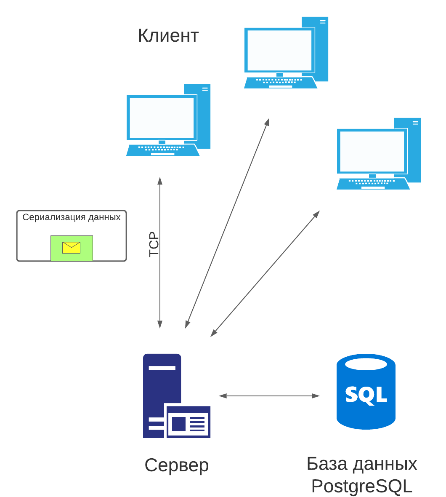

# Сеть 🕸️

## Сервер

- [Реализация сервера](../src/server)
- [Настройка адреса и порта](../src/server/config.h)

Для передачи данных по сети применяется сокетное программирование
с использованием протокола TCP. Топология подключения
клиентов - звезда. 

Под работу сервера выделяется 4 потока, которые обрабатывают прочитанные запросы пользователей.

Для мультиплексированного приема данных на сервере
используется kqueue (аналог epoll).

### 🚨 Notice
`Код писался под MacOS и не поддерживается Linux-ом из-за использования kqueue`

## Сериализация

Для передачи запросов/ответов используется (де-)сериализация данных, реализованная [здесь](../src/buffers).

## База данных

Сервер подключен к базе данных, хранящей информацию о пользователях и сообщения.
Используется диалект PostgreSQL и библиотека [libpqxx](https://github.com/jtv/libpqxx).